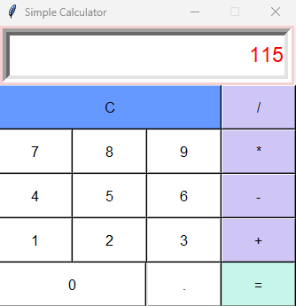

# GUI Calculator Application

## Technologies Used
- **Python:** The entire application is written in Python, a versatile programming language known for its simplicity and readability.
- **Tkinter:** Tkinter is the standard GUI library for Python. It provides tools for creating graphical user interfaces.

## Description
This project is a simple GUI-based calculator application built using Python and Tkinter. It provides a visually appealing interface with buttons for each digit and basic arithmetic operations (addition, subtraction, multiplication, division).

## Features
- User-Friendly Interface: The calculator has a clean and intuitive graphical interface that allows users to input numbers and perform calculations with ease.
- Basic Arithmetic Operations: The calculator supports addition, subtraction, multiplication, and division of numbers.
- Error Handling: The application is equipped to handle errors such as division by zero or invalid expressions.
- Clear Function: There is a 'C' button to clear the display, making it convenient for users to start a new calculation.

## How to Use
**1.  Launching the Application**
- Run the Python script **[calculator.py](calculator.py)**.

**2.  Performing Calculations**
- Use the buttons to input numbers and select operations.
- Click the **'='** button to get the result.

**3.  Clearing Display**
- Click the **'C'** button to clear the display.

## Usage Example
1. Input: **'5 + 3 ='**  
Output: **'8'**

2. Input: **'10 / 0 ='**  
Output: **'Error'**

## Snapshot

## Development
If you'd like to contribute or modify this project, feel free to fork the repository and submit a pull request.