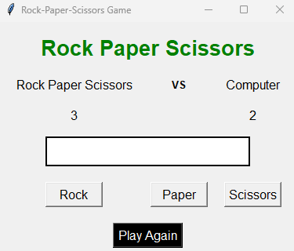

# Rock-Paper-Scissors Game

## Description
This application is a GUI-based Rock-Paper-Scissors game implemented using the Tkinter library in Python. It allows users to play the classic game against a computer opponent.

## Technologies Used
- **Python:** The primary programming language used for this application.
- **Tkinter:** A standard Python library for creating graphical user interfaces.
- **Random Module:** Used to generate a random choice for the computer opponent.

## How It Works
**1. Initializing the GUI**
- The main window of the application is created using Tkinter.
- A title is set for the window, which reads "Rock-Paper-Scissors Game".

**2. Creating UI Elements**
- A label is added to display instructions to the user.
- Buttons are created for the user to select their choice (Rock, Paper, or Scissors).

**3. Button Click Event**
- Each button is associated with a function (**'user_choice'**) using the **'command'** parameter.
- When a button is clicked, it calls the **'user_choice'** function with the respective choice.

**4. User Choice and Game Logic**
- The **user_choice** function is responsible for handling the game logic.
- It generates a random choice for the computer.
- Determines the winner based on user and computer choices.
- Updates the score.

**5. Displaying Results and Score**
- Labels are used to display the user's choice, computer's choice, and the winner.
- Another label displays the current scores of the user and computer.

**6. Play Again Function**
- A "Play Again" button is provided to reset the game.
- Clicking this button resets the scores and clears the result labels.

**7. Game Continuation**
- The game continues until the user decides to exit the application.

## How to Run
- Ensure you have Python installed on your system.
- Run the **'[rock-paper-scissors-game.py](rock-paper-scissors-game.py)'** script using a Python interpreter.

## How does it look

## Future Improvements
- Implement sound effects for button clicks and game results.
- Add images for the rock, paper, and scissors buttons to enhance visual appeal.
- Create a more sophisticated AI for the computer opponent.
- Implement multiplayer mode.
